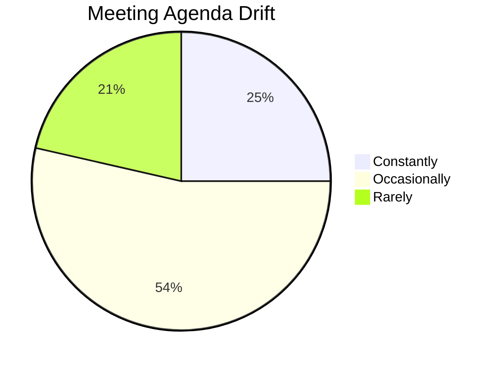
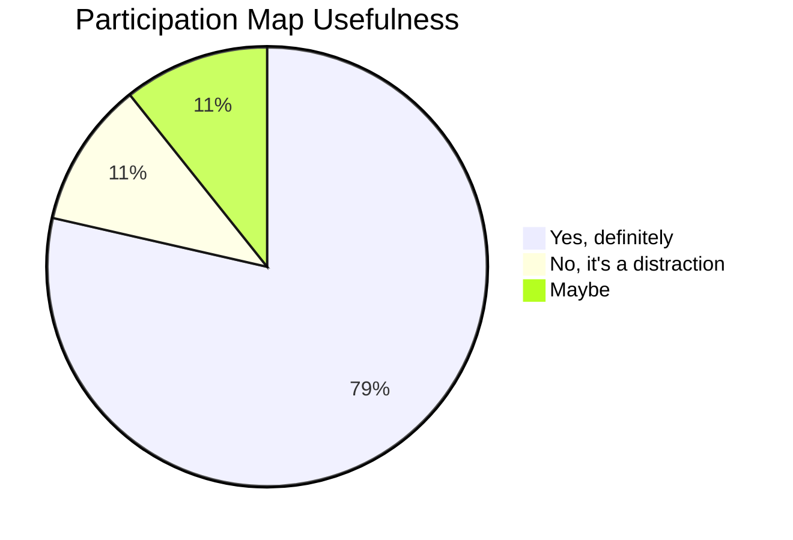
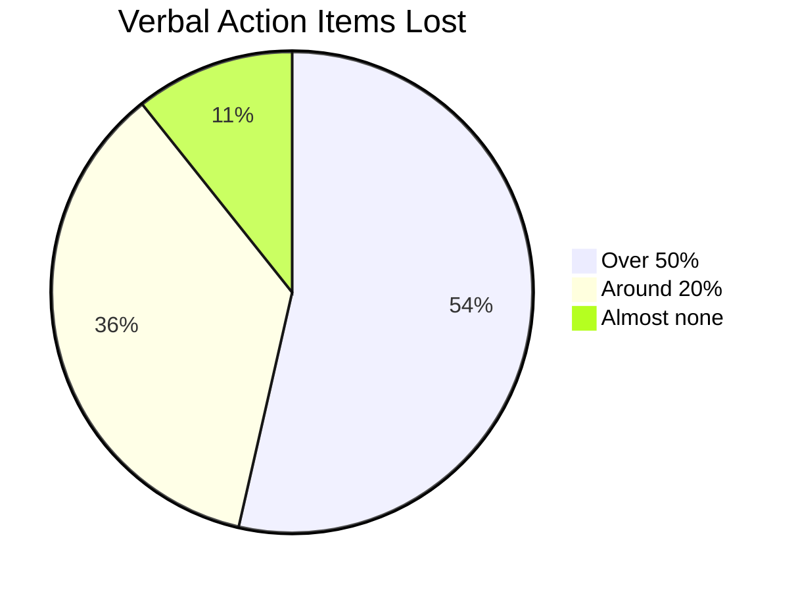
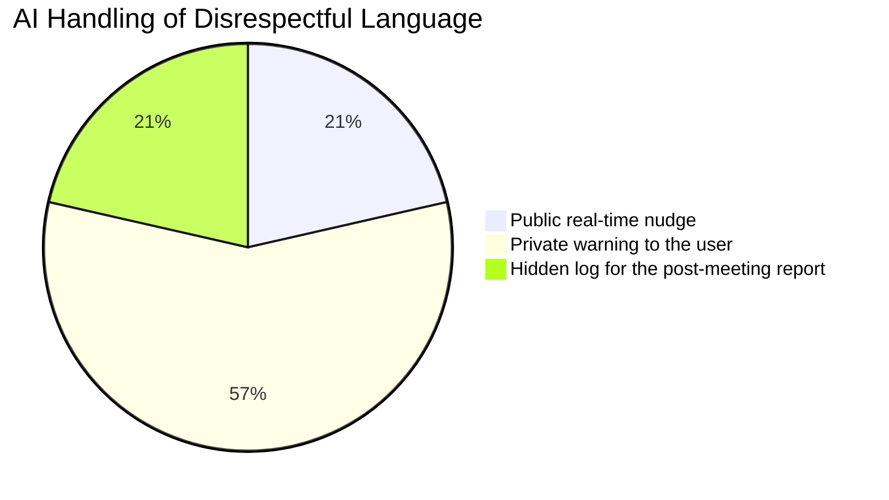
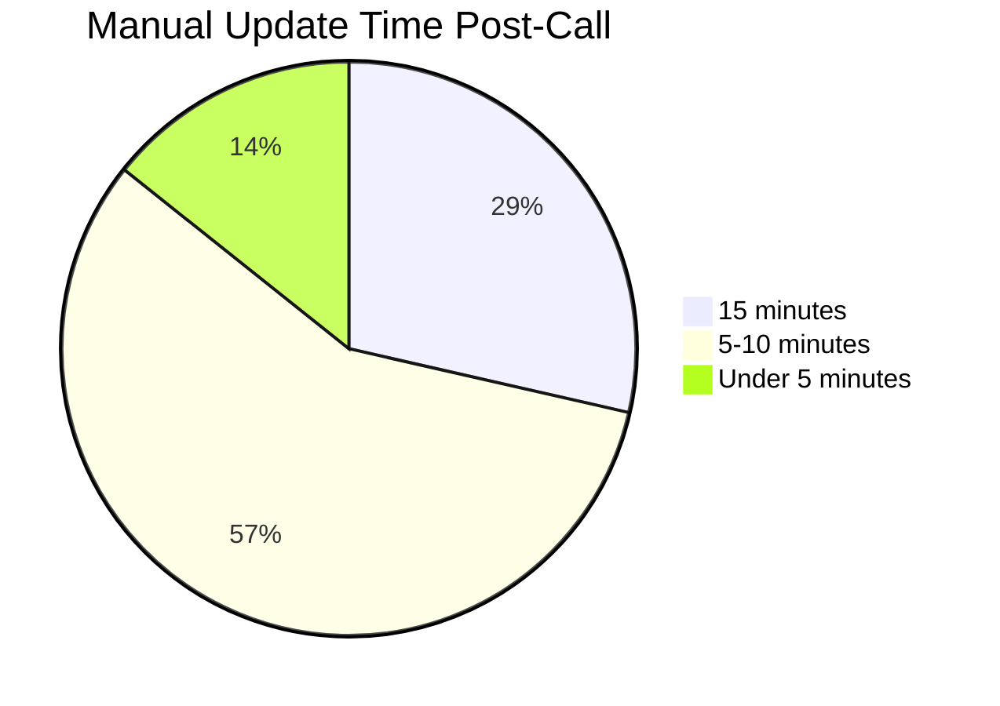
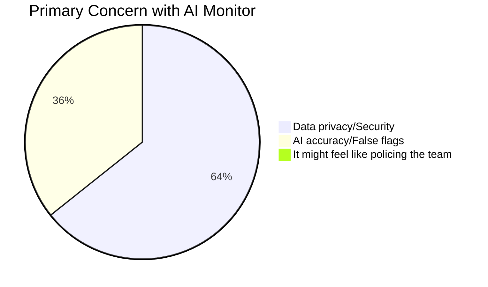

# 📄 Team Contributions & Documents

Welcome to the MeetScribe AI documentation page. This document tracks the contributions of each team member and links to key design and implementation details.

---

## 👥 Team Members

| Name | Role | Primary Responsibilities |
| :--- | :--- | :--- |
| Abhiraj | Team Lead and Developer | AI integration.HuggingFace Inference integration & Gemini 1.5 logic. |
| Ayush kumar | Test lead and git hub management | Popup UI, settings management, and dashboard implementation. |
| Chethana SB | Developer and git hub management | Core extension logic, sidebar design |
| Garvit singh | Development lead | Testing for cross-platform support (Zoom/Teams) |
| Aditya raj | Customer Contact lead | Customer approches through survey and forms |
| Hardik jha | testing and devops | Testing for cross-platform support (Zoom/Teams) & deployment. |
---

## 📝 Document Ownership

### 1. **Core Extension Implementation**
*   **Managed By**: Chethana SB
*   **Focus**: `manifest.json`, `service-worker.js`, and `offscreen.js`.
*   **Key Achievement**: Successfully implemented the foundational extension structure and core logic.

### 2. **AI Logic & Integration**
*   **Managed By**: Abhiraj
*   **Focus**: Transcription engines and tone analysis processors.
*   **Key Achievement**: Integrated HuggingFace Inference with Whisper for real-time transcription and Gemini 1.5 for analysis.

### 3. **UI/UX & Interactive Dashboard**
*   **Managed By**: Ayush kumar
*   **Focus**: `popup`, `dashboard`, and settings management.
*   **Key Achievement**: Developed the user-facing interface and settings configuration system.

### 4. **Testing & DevOps**
*   **Managed By**: Hardik jha & Garvit singh
*   **Focus**: Cross-platform compatibility and deployment pipelines.
*   **Key Achievement**: Ensured stable performance across Google Meet and Zoom environments.

### 5. **User Research & Feedback**
*   **Managed By**: Aditya raj
*   **Focus**: Customer surveys and feedback loops.
*   **Key Achievement**: Conducted the Meeting Efficiency and AI Integration Survey with 28 valid participants. Full results below.

---

## Customer Survey Results

**Meeting Efficiency and AI Integration Survey**
Total Respondents: 28

---

### Q1. How often do your meetings drift away from the set agenda?

| Answer Choices | Responses | Percentage |
|---|---|---|
| Constantly | 7 | 25% |
| Occasionally | 15 | 53.57% |
| Rarely | 6 | 21.43% |
| **Valid Count** | **28** | |

---

### Q2. Would a real-time participation map help involve silent team members?

| Answer Choices | Responses | Percentage |
|---|---|---|
| Yes, definitely | 22 | 78.57% |
| No, it's a distraction | 3 | 10.71% |
| Maybe | 3 | 10.71% |
| **Valid Count** | **28** | |

---

### Q3. What percentage of verbal action items usually get forgotten or lost?

| Answer Choices | Responses | Percentage |
|---|---|---|
| Over 50% | 15 | 53.57% |
| Around 20% | 10 | 35.71% |
| Almost none | 3 | 10.71% |
| **Valid Count** | **28** | |

---

### Q4. How should an AI handle disrespectful language in a live meeting?

| Answer Choices | Responses | Percentage |
|---|---|---|
| Public real-time nudge | 6 | 21.43% |
| Private warning to the user | 16 | 57.14% |
| Hidden log for the post-meeting report | 6 | 21.43% |
| **Valid Count** | **28** | |

---

### Q5. How much time do you spend manually updating JIRA or Trello after a call?

| Answer Choices | Responses | Percentage |
|---|---|---|
| 15 minutes | 8 | 28.57% |
| 5-10 minutes | 16 | 57.14% |
| Under 5 minutes | 4 | 14.29% |
| **Valid Count** | **28** | |

---

### Q6. What is your primary concern with using a real-time AI monitor?

| Answer Choices | Responses | Percentage |
|---|---|---|
| Data privacy/Security | 18 | 64.29% |
| AI accuracy/False flags | 10 | 35.71% |
| It might feel like policing the team | 0 | 0% |
| **Valid Count** | **28** | |

---

### Q7. Additional thoughts on AI integration in meetings

Open-ended responses — detailed data available separately.

---

## Product Requirements Specification (PRS)

---

### 1. Product Vision & Intent

People leaving meetings without a clear record of what was said or decided is a real, everyday problem. Over 53% of verbal action items get forgotten entirely (our own survey, 28 respondents), and professionals are spending 5–15 minutes after every call manually updating JIRA or Trello.

MeetScribe AI exists to fix that. It quietly sits in your browser during a meeting, transcribes everything in real time, picks out action items, and hands you a clean summary the moment the call ends — no effort required.

**Who it's for:** Team leads, project managers, and anyone who regularly sits through browser-based meetings on Google Meet, Zoom, or Microsoft Teams.

**How we'll know it's working:**
- 80% of active users save at least 10 minutes per meeting within 45 days of using it.
- At least 80% of action items from test sessions are captured correctly.

---

### 2. Scope Definition

**What MeetScribe AI does (Day 1):**
- Captures browser tab audio without interrupting the meeting
- Transcribes speech in real time via HuggingFace Whisper
- Labels speakers automatically (diarization)
- Analyzes tone and sentiment per speaker using Gemini 1.5 Flash
- Generates a structured post-meeting summary (decisions, action items, open questions)
- Extracts action items with assignees and due-date hints
- Saves all transcripts locally in the browser
- Exports transcripts in Markdown, JSON, SRT, and TXT
- Injects a lightweight collapsible sidebar into Meet, Zoom, and Teams

**What we're not doing yet:**
- Mobile apps
- Cloud sync or server-side storage
- JIRA / Trello direct push *(planned Week 3)*
- Multi-language support *(planned Week 3)*
- Firefox or Safari support

---

### 3. Functional Requirements

#### 3.1 What Users Can Do
- Start and stop recording from the sidebar
- Watch the transcript and speaker labels update live
- Browse, rename, and delete past meeting records
- Export any transcript in their preferred format
- Re-trigger a summary generation at any time

#### 3.2 What the System Does Automatically
- Detects meeting URLs and injects the sidebar
- Chunks audio every 3 seconds and sends it to Whisper
- Labels each segment by speaker
- Runs tone analysis per segment via Gemini
- Auto-generates a summary the moment recording stops
- Saves everything locally — no action needed from the user

#### 3.3 Core Workflow

1. User opens Google Meet / Zoom / Teams in Chrome
2. Sidebar appears automatically
3. User clicks "Start Recording" → permission prompt (first time only)
4. Live transcript with speaker labels and tone indicators appears
5. User clicks "Stop Recording"
6. Summary + action items generated in under 10 seconds
7. User exports or saves as needed

**If the API goes down:** Raw transcript is preserved locally, a friendly error appears, and nothing crashes.
**If permission is denied:** Recording doesn't start and the user gets a clear explanation of what to allow.

#### 3.4 Business Rules
- Recording only works on supported platforms (Meet, Zoom, Teams web)
- Tab capture permission required before any audio is processed
- Summary runs only after recording stops — never mid-session
- No audio or transcript data ever leaves for a MeetScribe server
- Partial transcripts are auto-saved if a tab closes mid-meeting

#### 3.5 Limits
- 3-second audio chunks (optimized for latency vs. API cost)
- Diarization works well for up to 4 concurrent speakers
- Chrome storage quota applies (~10 MB per transcript)
- Chrome only — no other browsers in v1
- API keys live in `chrome.storage.local`, never touched by page scripts

#### 3.6 Acceptance Criteria
- Sidebar appears within 2 seconds of joining a supported meeting
- First transcript chunk appears within 5 seconds of hitting record
- Summary ready within 10 seconds of stopping a 10-minute session
- Exported file is complete and in the correct format
- On API failure: error shown, no crash, no data lost

---

### 4. Non-Functional Requirements

**Performance:** Audio-to-text in ≤5 seconds (P95). Sidebar loads in ≤2 seconds. Less than 5% added CPU load on the tab.

**Scalability:** No shared backend — each user runs the extension independently. The only scaling bottleneck is API rate limits, managed by sequential chunked requests. Swapping to a paid or self-hosted Whisper model changes only the API adapter layer.

**Reliability:** Offline-safe — transcript viewing, deleting, and exporting work without internet. AI features degrade gracefully with an error banner if APIs are unreachable.

**Security & Privacy:** Audio goes directly to HuggingFace and Gemini over HTTPS. Nothing is stored server-side. API keys are isolated in the service worker. Transcripts stay on the user's device until they delete them. Our survey confirmed 64.29% of users are most worried about privacy — this architecture was built with that in mind.

**Extensibility:** Adding a new meeting platform = one new content script. Swapping the AI model = one new adapter. Adding an export format = one new formatter module.

---

### 5. Data & Integrations

**Entities:** Meeting, TranscriptSegment, Speaker, ActionItem, MeetingSummary

**External services:**

| Service | What it does |
|---|---|
| HuggingFace Inference API (Whisper) | Real-time transcription |
| Google Gemini 1.5 Flash | Tone analysis + meeting summaries |
| `chrome.tabCapture` / `chrome.offscreen` | Browser audio capture |
| `chrome.storage.local` | Local transcript storage |

---

### 6. UX & Accessibility

- Sidebar is collapsible and must not block video tiles or platform controls
- Supports Google Meet, Zoom web, and Microsoft Teams web
- Dark mode required; adapts to the host page theme
- WCAG 2.1 AA contrast standards apply for all text
- Recording is fully passive — no babysitting required once started
- All controls must be keyboard-navigable with visible focus states

---

### 7. What We're Measuring

| Metric | Goal |
|---|---|
| Weekly active recording sessions | Track week-over-week growth |
| Transcription accuracy | ≥ 95% on clear English audio |
| API error rate | < 2% |
| Audio-to-transcript latency | ≤ 5s (P95) |
| Action item precision | ≥ 80% in test sessions |
| Summary generation time | ≤ 10s post-session |

---

### 8. Risks & Assumptions

| | |
|---|---|
| **Assumes** | HuggingFace and Gemini free tiers stay stable under normal usage |
| **Risk** | Chrome MV3 API changes could require offscreen/tabCapture adapter updates |
| **Risk** | Meet / Zoom / Teams DOM updates could break sidebar injection |
| **Risk** | Privacy concerns (64.29% of users) may slow adoption without clear in-app transparency |
| **Risk** | Diarization quality degrades with 5+ simultaneous speakers |
| **Depends on** | Chrome v120+ |

---

### 9. Release Checklist

- [ ] Sidebar injection works on Meet, Zoom, and Teams
- [ ] Record/stop flow passes on all three platforms
- [ ] Transcription ≥ 95% accurate on 10 test recordings
- [ ] Summaries correct for 5, 15, and 30-minute sessions
- [ ] Action item precision ≥ 80% across 5 test sessions
- [ ] All 4 export formats produce valid output
- [ ] API failures handled gracefully (no crash, data preserved)
- [ ] Zero critical console errors during a full session
- [ ] Dark mode verified on all platforms
- [ ] WCAG 2.1 AA contrast check passed

## Internal Links

*   **[API Configuration Guide](./docs/API_CONFIG.md)**: Steps to obtain keys.
*   **[Style Guide](./docs/STYLE_GUIDE.md)**: UI/UX design tokens and CSS patterns.
*   **[Testing Protocol](./docs/TESTING.md)**: Manual and automated test cases.

---

*Last Updated: 2026-03-25 — PRS completed for MeetScribe AI*

