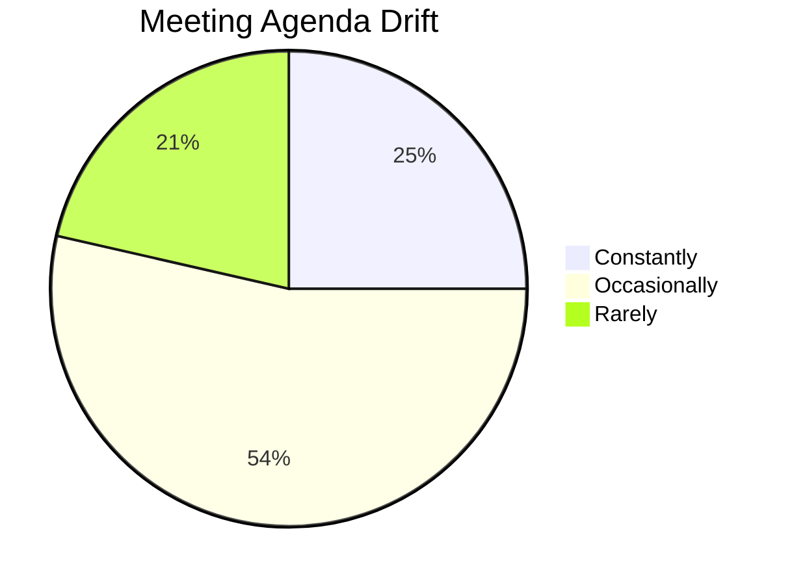
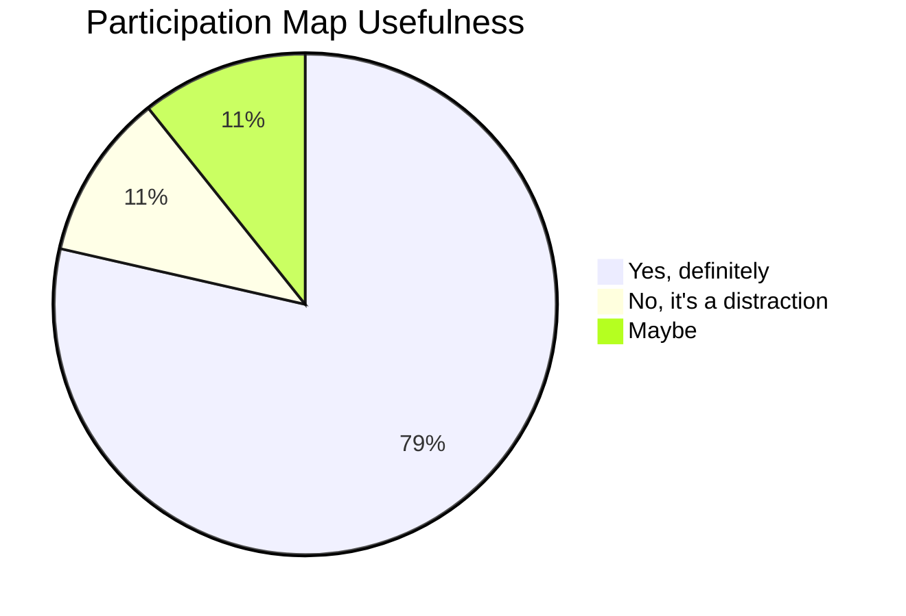
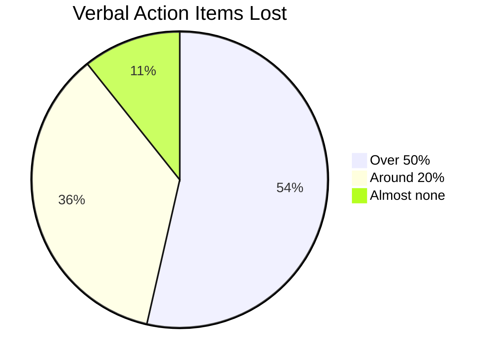
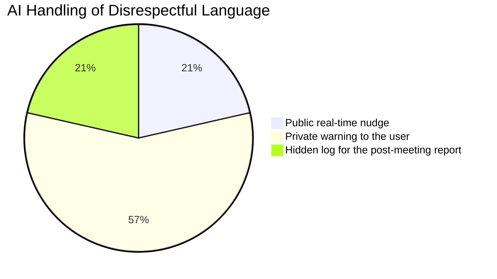
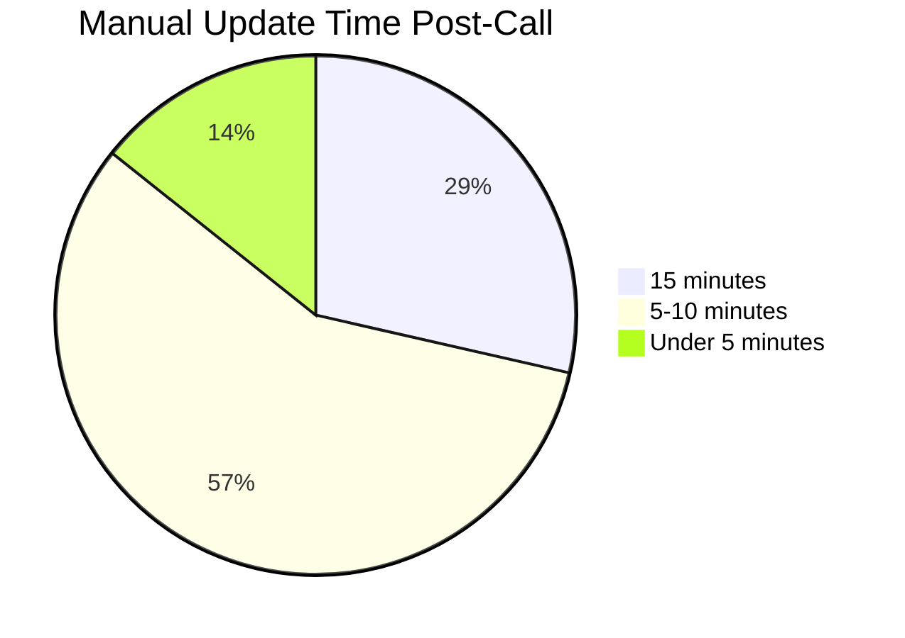
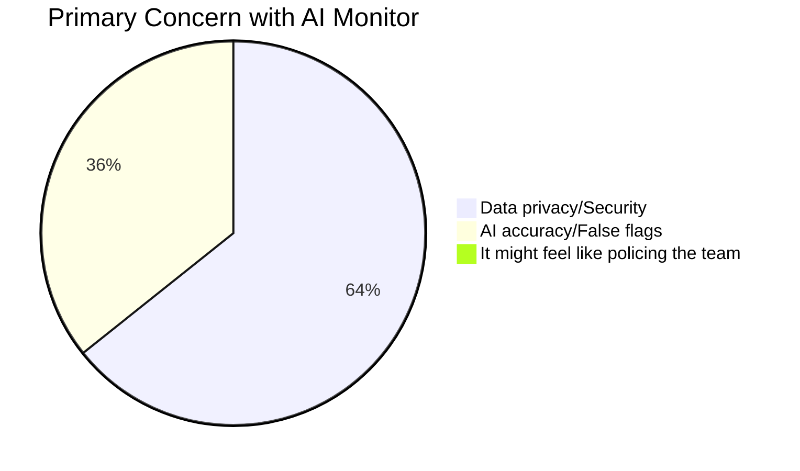

# 📄 Team Contributions & Documents

Welcome to the MeetScribe AI documentation page. This document tracks the contributions of each team member and links to key design and implementation details.

---

## 👥 Team Members

| Name | Role | Primary Responsibilities |
| :--- | :--- | :--- |
| Abhiraj | Team Lead and Developer | AI integration.HuggingFace Inference integration & Gemini 1.5 logic. |
| Ayush kumar | Test lead and git hub management | Popup UI, settings management, and dashboard implementation. |
| Chethana SB | Developer and git hub management | Core extension logic, sidebar design |
| Garvit singh | Development lead | Testing for cross-platform support (Zoom/Teams) |
| Aditya raj | Customer Contact lead | Customer approches through survey and forms |
| Hardik jha | testing and devops | Testing for cross-platform support (Zoom/Teams) & deployment. |
---

## 📝 Document Ownership

### 1. **Core Extension Implementation**
*   **Managed By**: Chethana SB
*   **Focus**: `manifest.json`, `service-worker.js`, and `offscreen.js`.
*   **Key Achievement**: Successfully implemented the foundational extension structure and core logic.

### 2. **AI Logic & Integration**
*   **Managed By**: Abhiraj
*   **Focus**: Transcription engines and tone analysis processors.
*   **Key Achievement**: Integrated HuggingFace Inference with Whisper for real-time transcription and Gemini 1.5 for analysis.

### 3. **UI/UX & Interactive Dashboard**
*   **Managed By**: Ayush kumar
*   **Focus**: `popup`, `dashboard`, and settings management.
*   **Key Achievement**: Developed the user-facing interface and settings configuration system.

### 4. **Testing & DevOps**
*   **Managed By**: Hardik jha & Garvit singh
*   **Focus**: Cross-platform compatibility and deployment pipelines.
*   **Key Achievement**: Ensured stable performance across Google Meet and Zoom environments.

### 5. **User Research & Feedback**
*   **Managed By**: Aditya raj
*   **Focus**: Customer surveys and feedback loops.
*   **Key Achievement**: Conducted the Meeting Efficiency and AI Integration Survey with 28 valid participants. Full results below.

---

## Customer Survey Results

**Meeting Efficiency and AI Integration Survey**
Total Respondents: 28

---

### Q1. How often do your meetings drift away from the set agenda?

| Answer Choices | Responses | Percentage |
|---|---|---|
| Constantly | 7 | 25% |
| Occasionally | 15 | 53.57% |
| Rarely | 6 | 21.43% |
| **Valid Count** | **28** | |

---

### Q2. Would a real-time participation map help involve silent team members?

| Answer Choices | Responses | Percentage |
|---|---|---|
| Yes, definitely | 22 | 78.57% |
| No, it's a distraction | 3 | 10.71% |
| Maybe | 3 | 10.71% |
| **Valid Count** | **28** | |

---

### Q3. What percentage of verbal action items usually get forgotten or lost?

| Answer Choices | Responses | Percentage |
|---|---|---|
| Over 50% | 15 | 53.57% |
| Around 20% | 10 | 35.71% |
| Almost none | 3 | 10.71% |
| **Valid Count** | **28** | |

---

### Q4. How should an AI handle disrespectful language in a live meeting?

| Answer Choices | Responses | Percentage |
|---|---|---|
| Public real-time nudge | 6 | 21.43% |
| Private warning to the user | 16 | 57.14% |
| Hidden log for the post-meeting report | 6 | 21.43% |
| **Valid Count** | **28** | |

---

### Q5. How much time do you spend manually updating JIRA or Trello after a call?

| Answer Choices | Responses | Percentage |
|---|---|---|
| 15 minutes | 8 | 28.57% |
| 5-10 minutes | 16 | 57.14% |
| Under 5 minutes | 4 | 14.29% |
| **Valid Count** | **28** | |

---

### Q6. What is your primary concern with using a real-time AI monitor?

| Answer Choices | Responses | Percentage |
|---|---|---|
| Data privacy/Security | 18 | 64.29% |
| AI accuracy/False flags | 10 | 35.71% |
| It might feel like policing the team | 0 | 0% |
| **Valid Count** | **28** | |

---

### Q7. Additional thoughts on AI integration in meetings

Open-ended responses — detailed data available separately.

---

## 🔗 Internal Links

*   **[API Configuration Guide](./docs/API_CONFIG.md)**: Steps to obtain keys.
*   **[Style Guide](./docs/STYLE_GUIDE.md)**: UI/UX design tokens and CSS patterns.
*   **[Testing Protocol](./docs/TESTING.md)**: Manual and automated test cases.

---

*Last Updated: 2026-03-24 — Survey results added*
