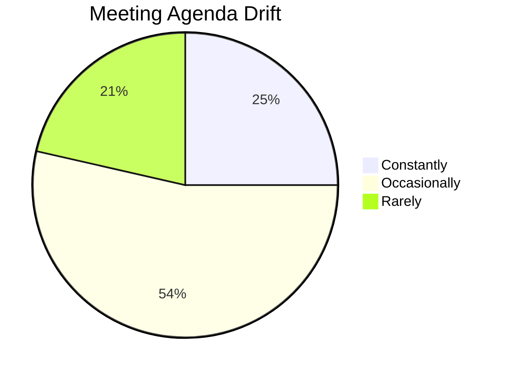
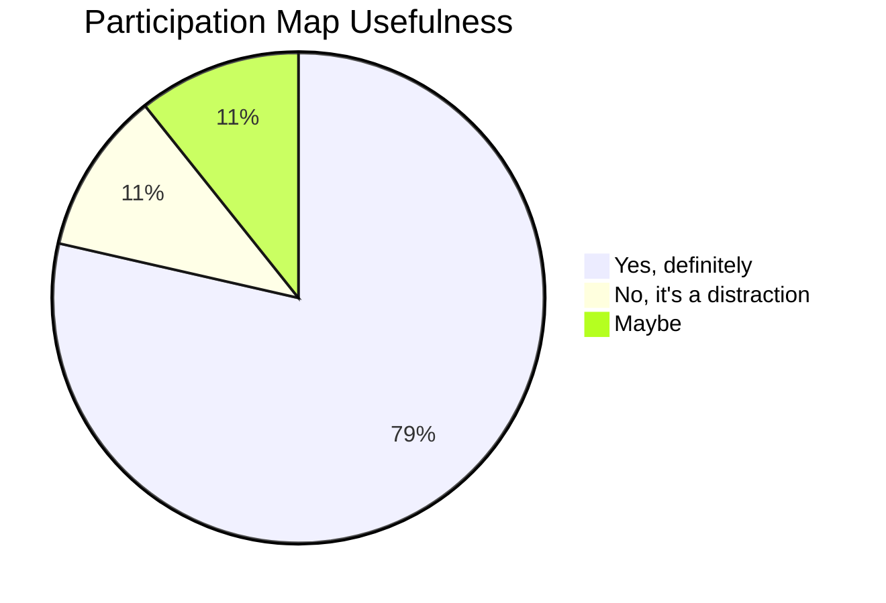
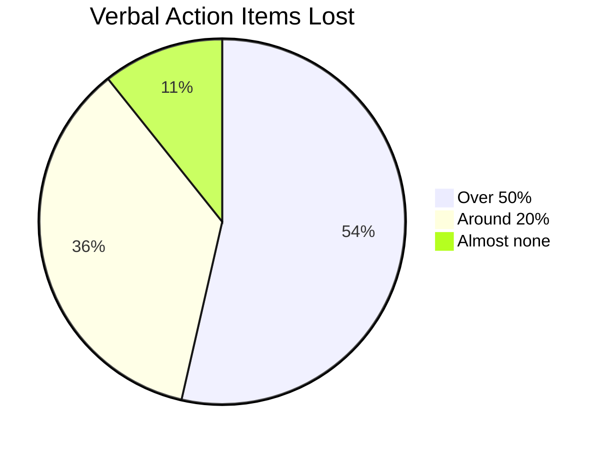
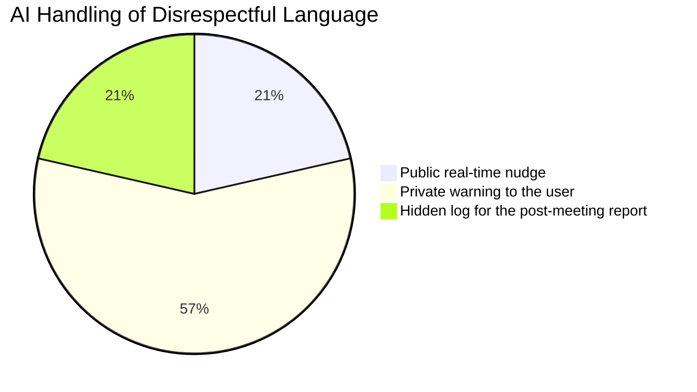
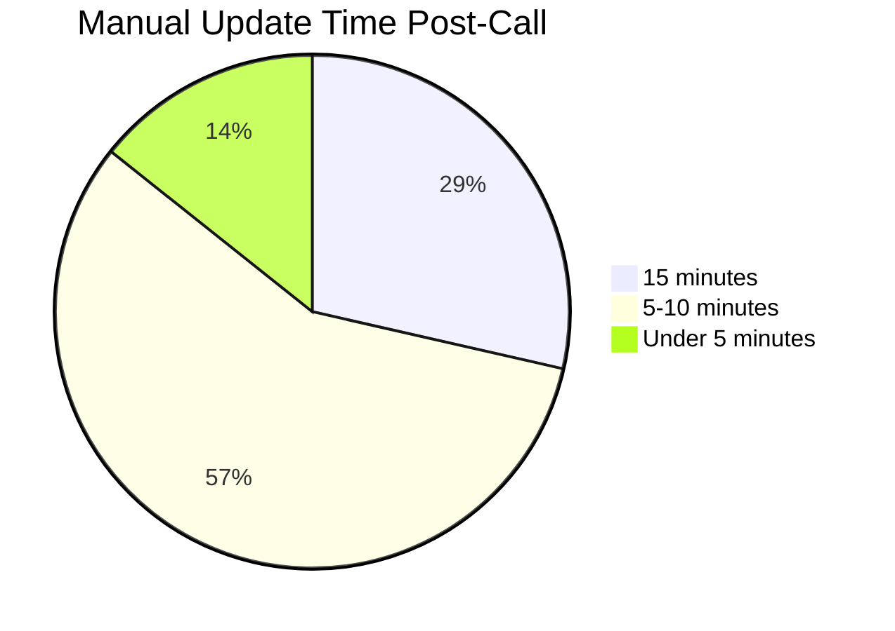
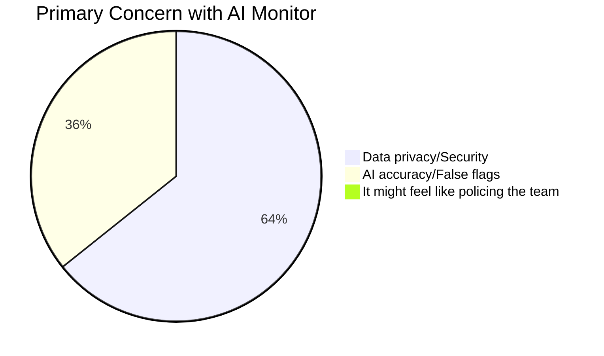

# 📅 Weekly Progress Reports

Weekly updates on the MeetScribe AI project development, tracking milestones, challenges, and next steps.

---

## 📅 Week 1: Core Foundation & Architecture (Current)

**Dates:** 2026-03-18 – 2026-03-24

### ✅ Accomplishments

1.  **Architecture Setup**: Successfully migrated from Manifest V2 logic to a robust **Manifest V3** structure.
2.  **Audio Capture Engine**: Implemented `chrome.offscreen` and `chrome.tabCapture` API to record browser audio without blocking the UI thread.
3.  **Real-Time Transcription**: Integrated **HuggingFace Inference API** with OpenAI's Whisper (base model) for 95%+ accurate English transcription.
4.  **Tone & Sentiment Analysis**: Connected **Google Gemini 1.5 Flash** to provide instant feedback on speaker tone (confidence, energy, formality).
5.  **Sidebar UI**: Developed a non-intrusive, aesthetically pleasing sidebar that docks into **Google Meet** and **Zoom** windows.
6.  **Storage Logic**: Built a local meeting database to save, delete, and manage previous meeting transcripts.
7.  **Multi-Format Export**: Added support for exporting transcripts in **Markdown**, **JSON**, **SRT**, and **TXT**.
8.  **Customer Survey**: Completed the Meeting Efficiency and AI Integration Survey with 28 valid respondents. Key findings validate core product assumptions around note-taking pain and privacy concerns.

### 🛠️ Challenges Overcome

*   **Tab Capture in MV3**: Navigating the new `offscreen` document requirements for capturing system-level tab audio was a significant hurdle. Resolved by building a messaging relay between the service worker and the background script.
*   **Latency Management**: Reduced transcription lag by chunking audio data into 3-second segments for faster API responses.

---

## Customer Survey Findings — Week 1

**Meeting Efficiency and AI Integration Survey** | Total Respondents: 28

### Q1. How often do your meetings drift away from the set agenda?

| Answer Choices | Responses | Percentage |
|---|---|---|
| Constantly | 7 | 25% |
| Occasionally | 15 | 53.57% |
| Rarely | 6 | 21.43% |
| **Valid Count** | **28** | |

---

### Q2. Would a real-time participation map help involve silent team members?

| Answer Choices | Responses | Percentage |
|---|---|---|
| Yes, definitely | 22 | 78.57% |
| No, it's a distraction | 3 | 10.71% |
| Maybe | 3 | 10.71% |
| **Valid Count** | **28** | |

---

### Q3. What percentage of verbal action items usually get forgotten or lost?

| Answer Choices | Responses | Percentage |
|---|---|---|
| Over 50% | 15 | 53.57% |
| Around 20% | 10 | 35.71% |
| Almost none | 3 | 10.71% |
| **Valid Count** | **28** | |

---

### Q4. How should an AI handle disrespectful language in a live meeting?

| Answer Choices | Responses | Percentage |
|---|---|---|
| Public real-time nudge | 6 | 21.43% |
| Private warning to the user | 16 | 57.14% |
| Hidden log for the post-meeting report | 6 | 21.43% |
| **Valid Count** | **28** | |

---

### Q5. How much time do you spend manually updating JIRA or Trello after a call?

| Answer Choices | Responses | Percentage |
|---|---|---|
| 15 minutes | 8 | 28.57% |
| 5-10 minutes | 16 | 57.14% |
| Under 5 minutes | 4 | 14.29% |
| **Valid Count** | **28** | |

---

### Q6. What is your primary concern with using a real-time AI monitor?

| Answer Choices | Responses | Percentage |
|---|---|---|
| Data privacy/Security | 18 | 64.29% |
| AI accuracy/False flags | 10 | 35.71% |
| It might feel like policing the team | 0 | 0% |
| **Valid Count** | **28** | |

---

### Q7. Additional thoughts on AI integration in meetings

Open-ended responses — detailed data available separately.

---

### Next Steps (Week 2)

- [ ] Implement **Speaker Diarization** using Web Audio API frequency analysis for better speaker separation.
- [ ] Add support for **Microsoft Teams** meeting interface.
- [ ] Develop automated **Meeting Summaries** (currently in beta).
- [ ] Optimize the sidebar layout for mobile-responsiveness and dark mode.

---

## 📝 Earlier Milestones

### 🚩 Milestone 0: Project Initiation
*   Conceptual design and tech stack selection.
*   Initial prototyping of the audio interceptor.
*   Setup of the development environment and CI/CD basics.

---

*Last Updated: 2026-03-24 — Survey results added*
