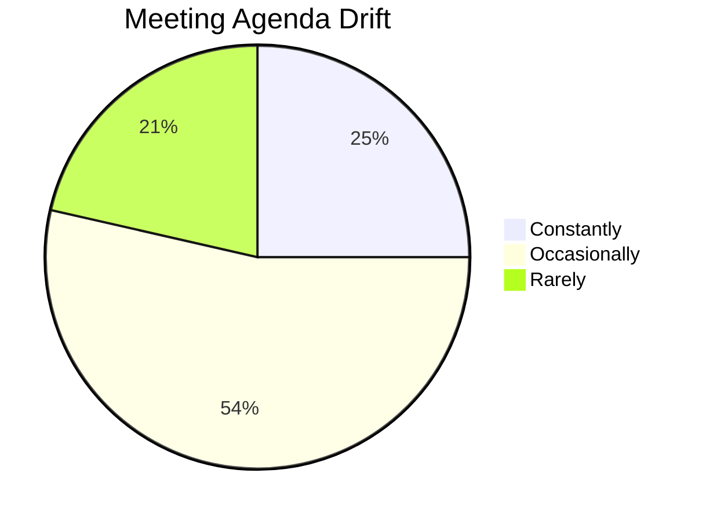
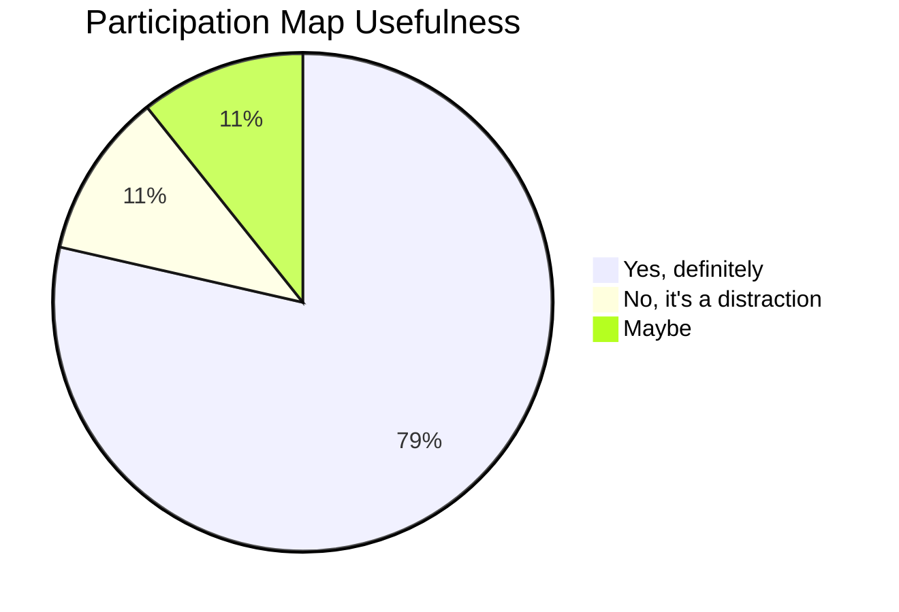
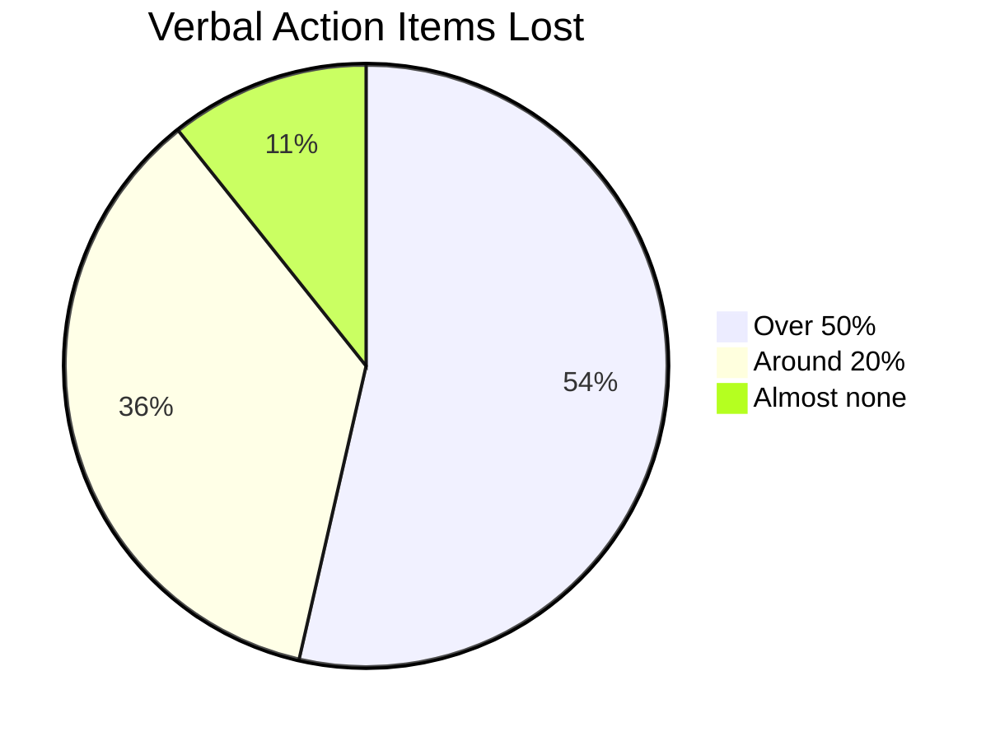
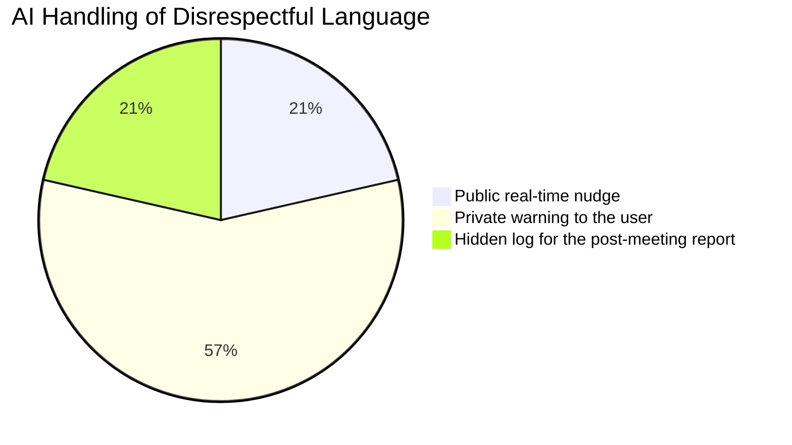
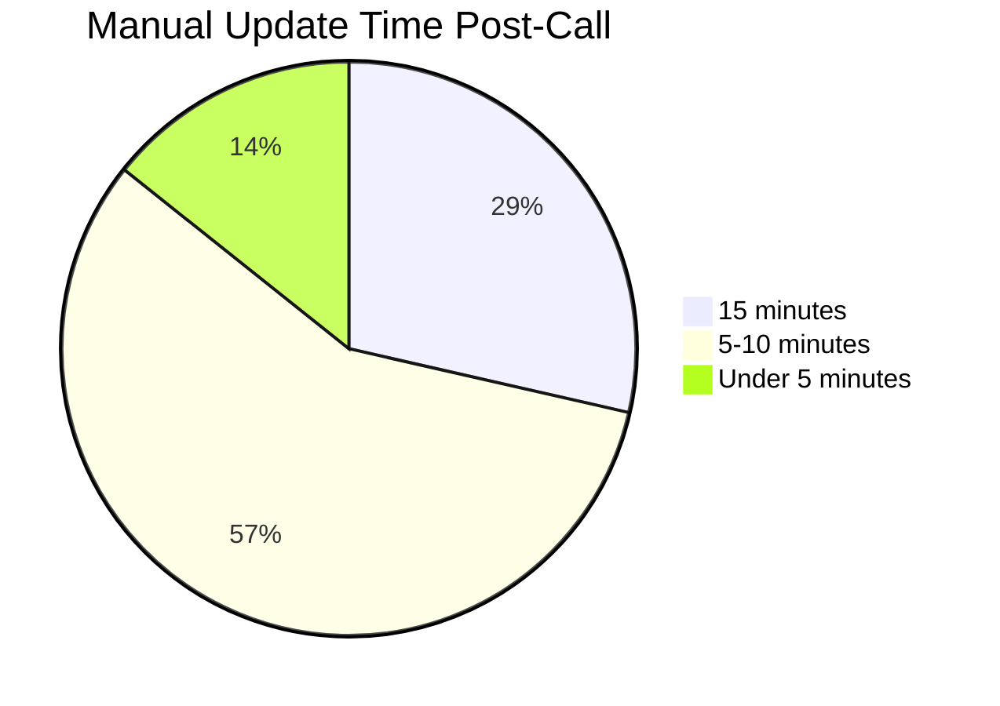
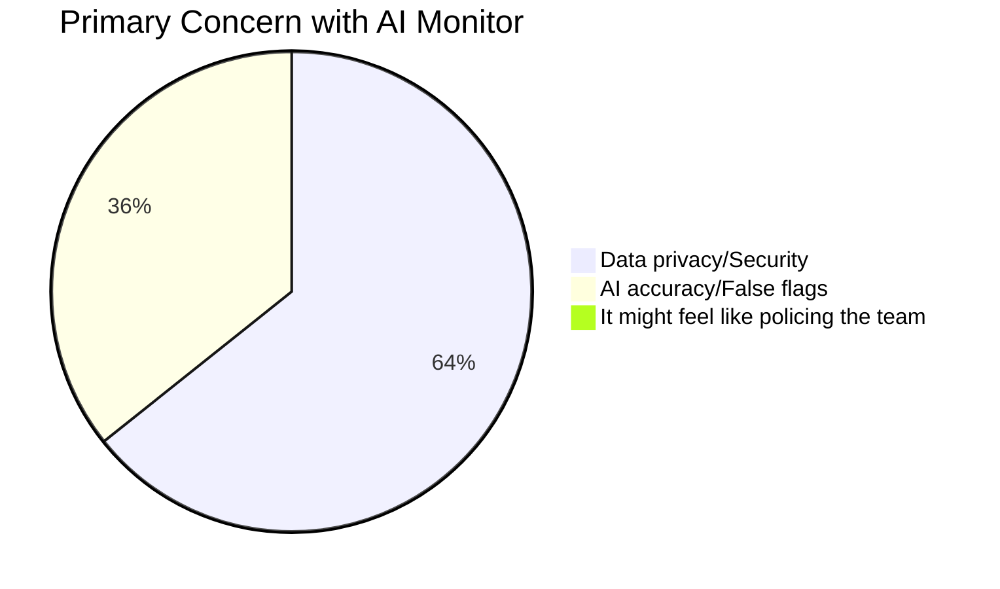

# Customer Interview & Survey Record

**Survey Title:** Meeting Efficiency and AI Integration Survey
**Managed By:** Aditya Raj (Customer Contact Lead)
**Total Respondents:** 28 Valid Participants

---

## Survey Results

### Q1. How often do your meetings drift away from the set agenda?

| Answer Choices | Responses | Percentage |
|---|---|---|
| Constantly | 7 | 25% |
| Occasionally | 15 | 53.57% |
| Rarely | 6 | 21.43% |
| **Valid Count** | **28** | |

---

### Q2. Would a real-time participation map help involve silent team members?

| Answer Choices | Responses | Percentage |
|---|---|---|
| Yes, definitely | 22 | 78.57% |
| No, it's a distraction | 3 | 10.71% |
| Maybe | 3 | 10.71% |
| **Valid Count** | **28** | |

---

### Q3. What percentage of verbal action items usually get forgotten or lost?

| Answer Choices | Responses | Percentage |
|---|---|---|
| Over 50% | 15 | 53.57% |
| Around 20% | 10 | 35.71% |
| Almost none | 3 | 10.71% |
| **Valid Count** | **28** | |

---

### Q4. How should an AI handle disrespectful language in a live meeting?

| Answer Choices | Responses | Percentage |
|---|---|---|
| Public real-time nudge | 6 | 21.43% |
| Private warning to the user | 16 | 57.14% |
| Hidden log for the post-meeting report | 6 | 21.43% |
| **Valid Count** | **28** | |

---

### Q5. How much time do you spend manually updating JIRA or Trello after a call?

| Answer Choices | Responses | Percentage |
|---|---|---|
| 15 minutes | 8 | 28.57% |
| 5-10 minutes | 16 | 57.14% |
| Under 5 minutes | 4 | 14.29% |
| **Valid Count** | **28** | |

---

### Q6. What is your primary concern with using a real-time AI monitor?

| Answer Choices | Responses | Percentage |
|---|---|---|
| Data privacy/Security | 18 | 64.29% |
| AI accuracy/False flags | 10 | 35.71% |
| It might feel like policing the team | 0 | 0% |
| **Valid Count** | **28** | |

---

### Q7. Additional thoughts on AI integration in meetings

Open-ended responses — detailed data available separately.

---

## Key Takeaways

- **78.57%** want real-time participation maps → validates speaker diarization feature
- **53.57%** lose over half their verbal action items → validates auto action-item extraction
- **64.29%** are most concerned about privacy → drives our 100% local storage architecture
- **57.14%** prefer private AI warnings → informs our tone analysis UX design

---

*Last Updated: 2026-03-25 — Week 1 survey completed*
